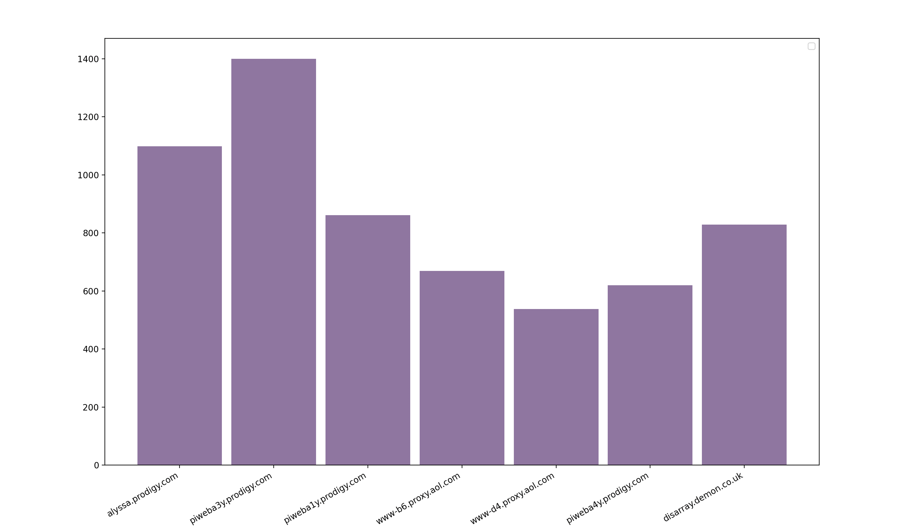
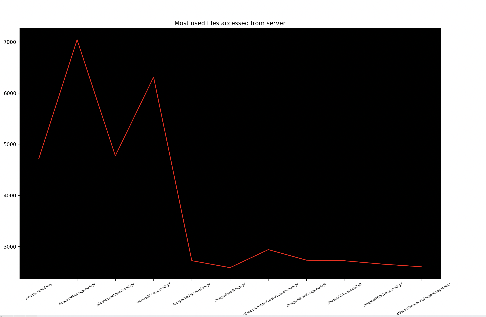

# Introduction
Hello Mr. Forlenza today I'll be showing you two graphs that I made. These two graphs show the most commmon IP Address used in the NASA logs and it also shows the most files accessed. In the graph you can see the analytical changes that occured aswell. 

## Most Common IP Addresses

The first thing I analyzed was the most commonly used IP addresses.With this graph you can see how many times a person looked up these certain websites throughoug the day over a period of time. I used 8 websites as seen on the graph to show visually the difference between them all. 
This is what I found: 
The most accessed IP address was piweba3y.prodigy.com
The leading website had a search history of over 12,000
The least visited website throughout this graph was www-b6.proxy.aol.com

## Most files accessed.

The second thing I analyzed was the most files accessed throughout this server.When looking at this analytical graph there is a few things that can be easily pointed out. Some these certain things is:
There was a peak reached at 70,000 files accessed in the logs
The least files accessed averaged around 2000 visits
The biggest file visitied was /shuttle/countdown

## Suggestions

Aftering reviewing all of the data throughout the logs the best solution to bettering and making more graphs would be to try and get more information thst could go towards it. Having more specific information that you can find about the users and the ip addresses they accessed could give an idea of how users operate throughout everything.
